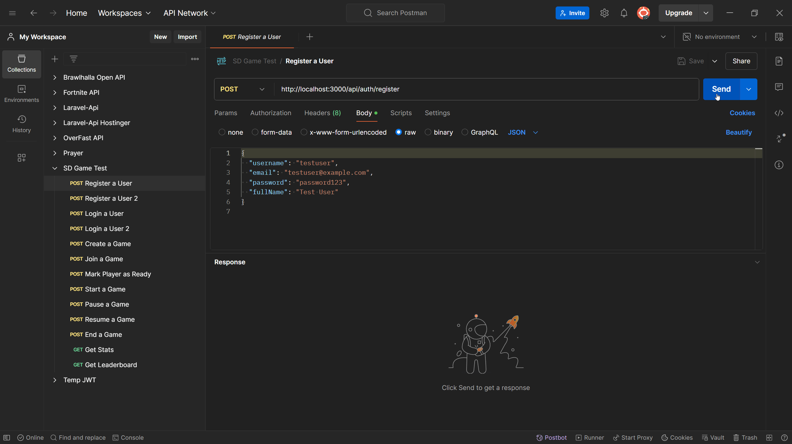
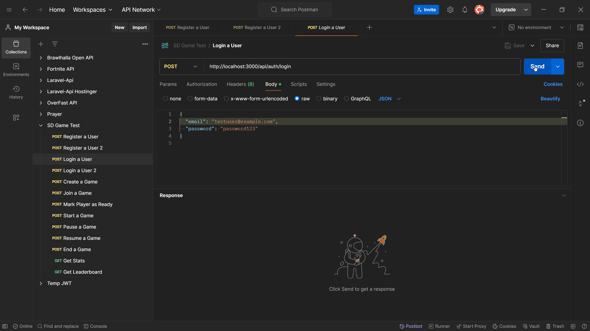
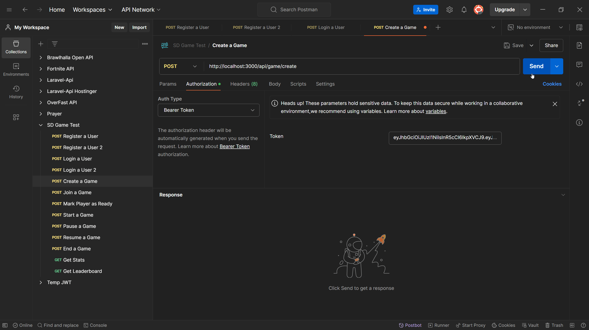
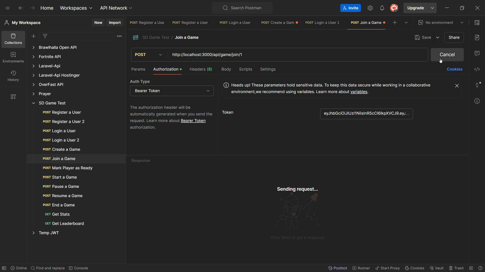
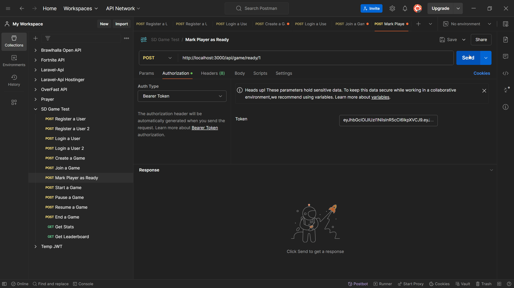
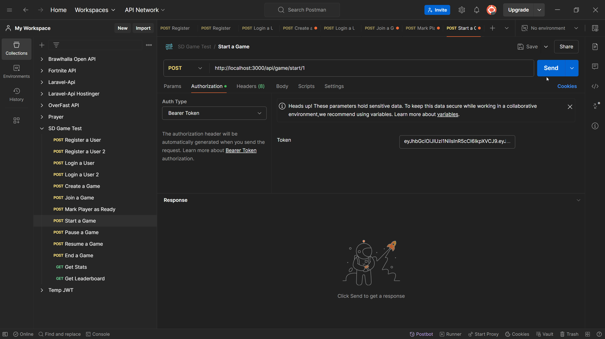
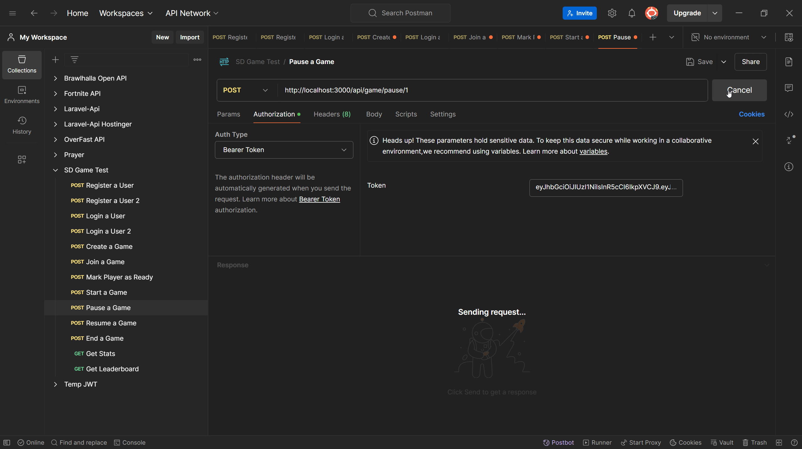
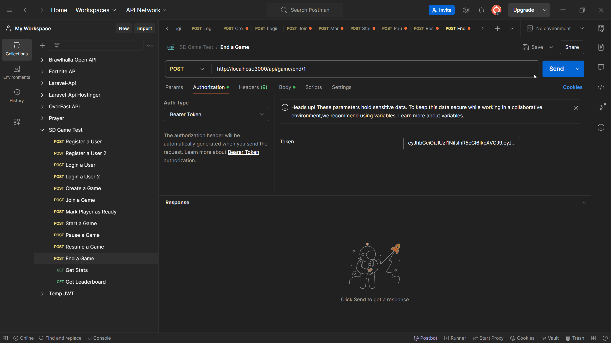
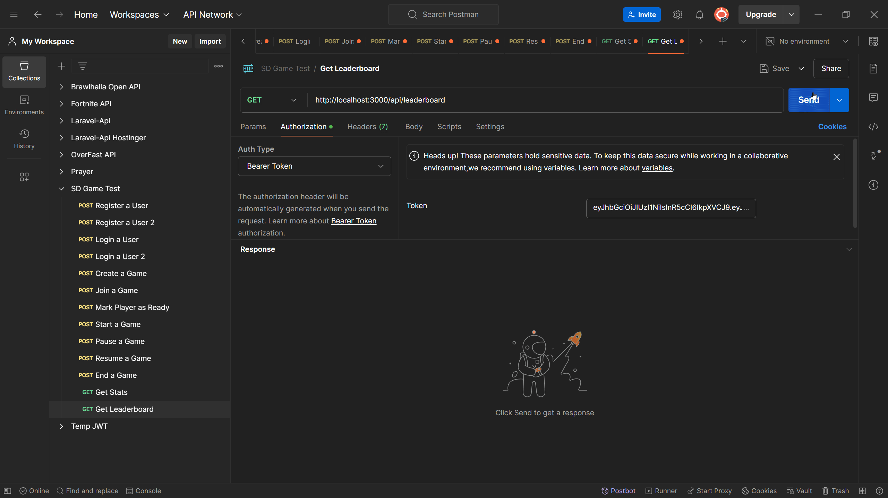

# Game Backend

This is a Node.js backend for a game application. It provides endpoints for user authentication, game management, and leaderboard functionalities. The application uses Express.js for the server, Sequelize as the ORM, and MySQL as the database.

## Table of Contents

- [Requirements](#requirements)
- [Installation](#installation)
- [Database Setup](#database-setup)
- [Running the Server](#running-the-server)
- [API Endpoints](#api-endpoints)
  - [Authentication](#authentication)
    - [Register](#register)
    - [Login](#login)
  - [Game Management](#game-management)
    - [Create Game](#create-game)
    - [Join Game](#join-game)
    - [Mark as Ready](#mark-as-ready)
    - [Start Game](#start-game)
    - [Pause Game](#pause-game)
    - [Resume Game](#resume-game)
    - [End Game](#end-game)
    - [Get Game Stats](#get-game-stats)
  - [Leaderboard](#leaderboard)
- [Project Structure](#project-structure)
- [Error Handling](#error-handling)
- [Conclusion](#conclusion)
- [Copyright](#copyright)

## Requirements

- Node.js (v14 or higher)
- MySQL
- npm

## Installation

1. Clone the repository:
   ```sh
   git clone <repository_url>
   cd <repository_folder>
   ```

2. Install dependencies:
   ```sh
   npm install
   ```

## Database Setup

1. Create a MySQL database named `db_name` using PHPMyAdmin.

2. Update the database connection details in `models/index.js` if needed:
   ```js
   const sequelize = new Sequelize('db_name', 'db_username', 'db_password', {
     host: 'localhost',
     dialect: 'mysql'
   });
   ```

3. If you need to delete all tables, use the following SQL commands in PHPMyAdmin:
   ```sql
   DROP TABLE IF EXISTS GamePlayers;
   DROP TABLE IF EXISTS Games;
   DROP TABLE IF EXISTS Users;
   ```

## Running the Server

Start the server:
```sh
node server.js
```

The server will be running on `http://localhost:3000`.

## API Endpoints

### Authentication

#### Register

- **Endpoint**: `POST /api/auth/register`
- **Request Body**:
  ```json
  {
    "username": "exampleUser",
    "email": "user@example.com",
    "password": "password123",
    "fullName": "Example User"
  }
  ```
- **Response**:
  - **Success**:
    ```json
    {
      "id": 1,
      "username": "exampleUser",
      "email": "user@example.com",
      "fullName": "Example User",
      "profileImage": "default.png",
      "gamesPlayed": 0,
      "wins": 0,
      "losses": 0,
      "createdAt": "2024-06-27T12:00:00.000Z",
      "updatedAt": "2024-06-27T12:00:00.000Z"
    }
    ```
  - **Error**:
    ```json
    {
      "error": "Error message"
    }
    ```
- **GIF**: 

#### Login

- **Endpoint**: `POST /api/auth/login`
- **Request Body**:
  ```json
  {
    "email": "user@example.com",
    "password": "password123"
  }
  ```
- **Response**:
  - **Success**:
    ```json
    {
      "token": "jwt_token"
    }
    ```
  - **Error**:
    ```json
    {
      "message": "Invalid credentials"
    }
    ```
- **GIF**: 

### Game Management

#### Create Game

- **Endpoint**: `POST /api/game/create`
- **Headers**:
  ```json
  {
    "Authorization": "Bearer jwt_token"
  }
  ```
- **Response**:
  - **Success**:
    ```json
    {
      "id": 1,
      "creatorId": 1,
      "ended": false,
      "duration": 0,
      "winnerId": null,
      "status": "lobby",
      "paused": false,
      "pausedAt": null,
      "totalPausedDuration": 0,
      "createdAt": "2024-06-27T12:00:00.000Z",
      "updatedAt": "2024-06-27T12:00:00.000Z"
    }
    ```
  - **Error**:
    ```json
    {
      "error": "Error message"
    }
    ```
- **GIF**: 

#### Join Game

- **Endpoint**: `POST /api/game/join/:id`
- **Headers**:
  ```json
  {
    "Authorization": "Bearer jwt_token"
  }
  ```
- **Response**:
  - **Success**:
    ```json
    {
      "message": "Joined game"
    }
    ```
  - **Error**:
    ```json
    {
      "message": "Game not found"
    }
    ```
- **GIF**: 

#### Mark as Ready

- **Endpoint**: `POST /api/game/ready/:id`
- **Headers**:
  ```json
  {
    "Authorization": "Bearer jwt_token"
  }
  ```
- **Response**:
  - **Success**:
    ```json
    {
      "message": "Player marked as ready",
      "player": {
        "userId": 1,
        "gameId": 1,
        "isReady": true,
        "createdAt": "2024-06-27T12:00:00.000Z",
        "updatedAt": "2024-06-27T12:00:00.000Z"
      }
    }
    ```
  - **Error**:
    ```json
    {
      "message": "Player not found in this game"
    }
    ```
- **GIF**: 


#### Start Game

- **Endpoint**: `POST /api/game/start/:id`
- **Headers**:
  ```json
  {
    "Authorization": "Bearer jwt_token"
  }
  ```
- **Response**:
  - **Success**:
    ```json
    {
      "message": "Game started",
      "game": {
        "id": 1,
        "creatorId": 1,
        "ended": false,
        "duration": 0,
        "winnerId": null,
        "status": "started",
        "paused": false,
        "pausedAt": null,
        "totalPausedDuration": 0,
        "createdAt": "2024-06-27T12:00:00.000Z",
        "updatedAt": "2024-06-27T12:00:00.000Z"
      }
    }
    ```
  - **Error**:
    ```json
    {
      "message": "All players must be ready to start the game"
    }
    ```
- **GIF**: 

#### Pause Game

- **Endpoint**: `POST /api/game/pause/:id`
- **Headers**:
  ```json
  {
    "Authorization": "Bearer jwt_token"
  }
  ```
- **Response**:
  - **Success**:
    ```json
    {
      "message": "Game paused",
      "game": {
        "id": 1,
        "creatorId": 1,
        "ended": false,
        "duration": 0,
        "winnerId": null,
        "status": "started",
        "paused": true,
        "pausedAt": "2024-06-27T12:30:00.000Z",
        "totalPausedDuration": 0,
        "createdAt": "2024-06-27T12:00:00.000Z",
        "updatedAt": "2024-06-27T12:30:00.000Z"
      }
    }
    ```
  - **Error**:
    ```json
    {
      "message": "Only started games can be paused"
    }
    ```
- **GIF**: 

#### Resume Game

- **Endpoint**: `POST /api/game/resume/:id`
- **Headers**:
  ```json
  {
    "Authorization": "Bearer jwt_token"
  }
  ```
- **Response**:
  - **Success**:
    ```json
    {
      "message": "Game resumed",
      "game": {
        "id": 1,
        "creatorId": 1,
        "ended": false,
        "duration": 0,
        "winnerId": null,
        "status": "started",
        "paused": false,
        "pausedAt": null,
        "totalPausedDuration": 1800,
        "createdAt": "2024-06-27T12:00:00.000Z",
        "updatedAt": "2024-06-27T13:00:00.000Z"
      }
    }
    ```
  - **Error**:
    ```json
    {
      "message": "Only paused games can be resumed"
    }
    ```
- **GIF**: 


#### End Game

- **Endpoint**: `POST /api/game/end/:id`
- **Headers**:
  ```json
  {
    "Authorization": "Bearer jwt_token"
  }
  ```
- **Request Body**:
  ```json
  {
    "winnerId": 1
  }
  ```
- **Response**:
  - **Success**:
    ```json
    {
      "message": "Game ended",
      "game": {
        "id": 1,
        "creatorId": 1,
        "ended": true,
        "duration": 3600,
        "winnerId": 1,
        "status": "ended",
        "paused": false,
        "pausedAt": null,
        "totalPausedDuration": 0,
        "createdAt": "2024-06-27T12:00:00.000Z",
        "updatedAt": "2024-06-27T13:00:00.000Z"
      }
    }
    ```
  - **Error**:
    ```json
    {
      "message": "Error message"
    }
    ```
- **GIF**: 

#### Get Game Stats

- **Endpoint**: `GET /api/game/stats/:id`
- **Headers**:
  ```json
  {
    "Authorization": "Bearer jwt_token"
  }
  ```
- **Response**:
  - **Success**:
    ```json
    {
      "id": 1,
      "creatorId": 1,
      "ended": true,
      "duration": 3600,
      "winnerId": 1,
      "status": "ended",
      "paused": false,
      "pausedAt": null,
      "totalPausedDuration": 0,
      "createdAt": "2024-06-27T12:00:00.000Z",
      "updatedAt": "2024-06-27T13:00:00.000Z",
      "players": [
        {
          "id": 1,
          "username": "exampleUser",
          "email": "user@example.com",
          "fullName": "Example User",
          "profileImage": "default.png",
          "gamesPlayed": 1,
          "wins": 1,
          "losses": 0,
          "GamePlayers": {
            "isReady": true,
            "createdAt": "2024-06-27T12:00:00.000Z",
            "updatedAt": "2024-06-27T12:00:00.000Z"
          }
        },
        ...
      ]
    }
    ```
  - **Error**:
    ```json
    {
      "message": "Game not found"
    }
    ```
- **GIF**: 


### Leaderboard

#### Get Leaderboard

- **Endpoint**: `GET /api/leaderboard`
- **Headers**:
  ```json
  {
    "Authorization": "Bearer jwt_token"
  }
  ```
- **Response**:
  - **Success**:
    ```json
    [
      {
        "id": 1,
        "username": "exampleUser",
        "email": "user@example.com",
        "fullName": "Example User",
        "profileImage": "default.png",
        "gamesPlayed": 10,
        "wins": 7,
        "losses": 3,
        "createdAt": "2024-06-27T12:00:00.000Z",
        "updatedAt": "2024-06-27T13:00:00.000Z"
      },
      ...
    ]
    ```
  - **Error**:
    ```json
    {
      "error": "Error message"
    }
    ```
- **GIF**: 

## Project Structure

```plaintext
.
│   package-lock.json
│   package.json
│   ReadMe.md
│   server.js
│
├───controllers
│       authController.js
│       gameController.js
│       leaderboardController.js
│
├───models
│       associations.js
│       Game.js
│       index.js
│       User.js
│  
├───node_modules
│  	
├───GIFs
│  	
│
└───routes
        authRoutes.js
        gameRoutes.js
        leaderboardRoutes.js

```

## Error Handling

All endpoints return errors in the following format:

```json
{
  "error": "Error message"
}
```

or

```json
{
  "message": "Error message"
}
```

Ensure to handle these errors appropriately in your frontend or API client to provide a smooth user experience.
```js
npm install express mysql2 sequelize bcryptjs jsonwebtoken
```

## Conclusion

This Game Backend project provides a comprehensive solution for user authentication, game management, and leaderboard functionalities. It is built using Node.js with Express, Sequelize ORM, and MySQL. The project is structured to be easily understandable and maintainable, making it a suitable starting point for further development and customization.

By following the provided instructions, you should be able to set up the project, run the server, and interact with the various API endpoints. Make sure to handle errors appropriately in your frontend or API client to ensure a smooth user experience.

## Copyright

All source code belongs to Mohammed Aleshawi. I am not responsible for any misuse of the code.

© 2024 Mohammed Aleshawi. All rights reserved.
"""